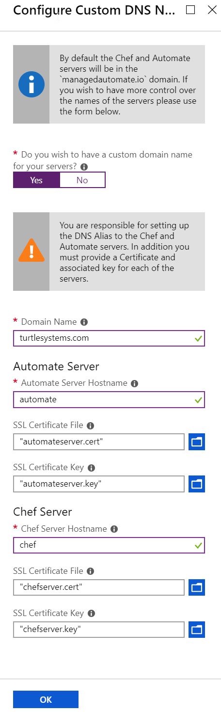

# Domain Names

In order to support different scenarios that customers have, it is possible to specify a custom domain and hostnames for the machines that are built as a result of these templates.

There are three patterns that are supported:

1. No custom domain name and is not a Managed App

In this case the servers will have a fully qualified domain name (FQDN) based on the prefix, server type, unique string and the domain for the region in Azure that was set. For example

```
Prefix: rjs
Server Type: chef
Unique String: fg6t
Azure Region: eastus

FQDN: rjs-chef-fg6t.eastus.cloudapp.azure.com
```

In this case the servers will utilise their own self signed certificates.

2. Managed App and no custom domain

Here the Managed App domain is `managedautomate.io` and the machines will be named accordingly.

```
Prefix: rjs
Server Type: chef
Unique String: fg6t

FQDN: rjs-chef-fg6t.managedautomate.io
```

During configuration the servers will attempt to get an SSL certificate from Lets Encrypt using the FQDN of the machine.

A cronjob is configured to run everyday to automatically renew the certificates as they are only valid for 90 days. As `certbot` is using the standalone mode it needs to shutdown the server proceses when a renewal has been successful.

| Server | Command |
|---|---|
| Automate | `certbot renew --pre-hook "chef-automate stop" --post-hook "chef-automate start"` |
| Chef | `certbot renew --pre-hook "chef-server-ctl stop nginx" --post-hook "chef-server-ctl start nginx`

By default the cron is set to run every day at 0030, however this can be changed using the parameters and the Portal UI.

3. Custom Domain Name

The final scenario allows complete customisation of the server hostnames and the domain that that they are configured with. Three parameters are required to be set `customDomainName`, `customChefServerHostname` and `customAutomateServerHostname`.

```
customChefServerHostname: mycorpchef
customDomainName: corp.com

FQDN: mycorpchef.corp.com

```

When using custom domain name it is possible to supply previously created certificates and keys for each server. This is achieved using the following parameters, if deploying the template manually.

 - customChefServerSSLCertificate
 - customChefServerSSLCertificateKey
 - customAutomateServerSSLCertificate
 - customAutomateServerSSLCertificateKey

When using the portal to deploy the Managed App the following fields are available.

